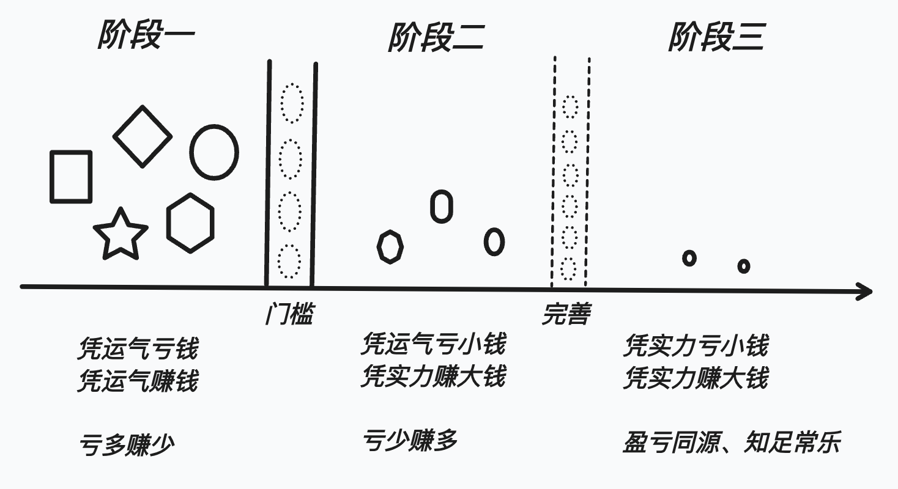

# 以交易为生

如果一个人想要以交易为生，大概的标准是：每天盈利至少300美金。

每天赚300，一年就是11万美金。与2023年美国家庭年收入中位数持平。

#### 做交易需要经历的几个阶段

阶段一  初级阶段：不自觉的追求能买在最低点、卖在最高点。凭运气赚钱和亏钱，稀里糊涂赚钱，稀里糊涂亏钱。结果：偶尔赚小钱、时常亏大钱。

阶段二  中级阶段：通过总结、反思和学习，开始知道，赚钱的交易不需要买在最低点、也不需要卖在最高点。追求顺势而为、知行合一。结果：时常小亏、偶尔大赚；甚至五五开；更甚至三七开。开始体会到交易的乐趣。

阶段三  高级阶段：眼中不再有价格，心中不再有涨跌，赚钱像呼吸一样自然，像喝水一样简单。结果：交易已经变成稀松平常的事，不再有乐趣，亏钱时波澜不惊，赚钱时心静如水。

从阶段一到阶段二，这是个门槛，需要思维的转变，很多人，终其一生都止步于阶段一。过了这个门槛，算是交易入门了。有些人可能会从阶段二又滑落回阶段一，甚至反复横跳，能稳定停留在阶段二的人，已经能稳定盈利了。

从阶段二到阶段三，只是不断完善和优化，这个过程需要练习很久，交易最终变成了机械操作和肌肉记忆。在阶段二呆的时间够久，可能不知不觉中就进入阶段三了。二三阶段分界没那么明显的。

---

> 本文创建日期: 2024-10-15
>
> 最后更新日期: 2024-10-16
